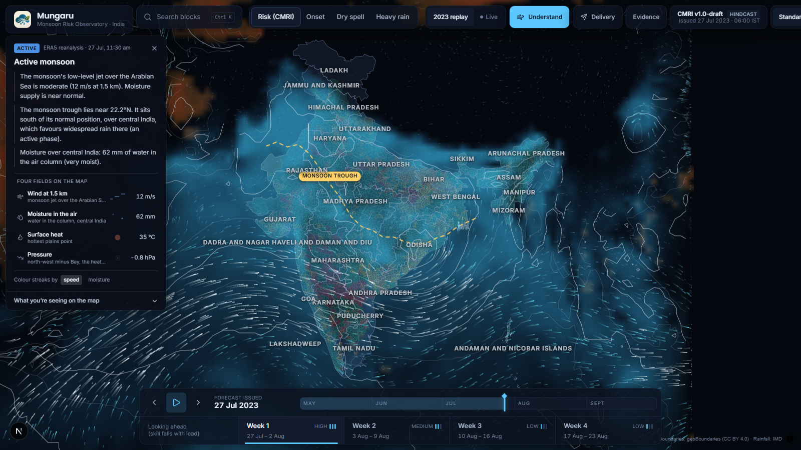

<p align="center">
  
</p>

<h1 align="center">Mungaru</h1>

<p align="center">
  <b>Block-level monsoon risk for India, and crop advice a farmer can act on.</b><br />
  Probabilistic outlooks for 6,824 blocks, explained, grounded in official contingency plans,
  and delivered on WhatsApp after an officer approves them.
</p>

<p align="center">
  
</p>

---

## The gap this closes

India's monsoon forecasts are issued for meteorological subdivisions, areas the size of a small
country. Farm decisions are made in a block. When to sow, whether to re-sow, whether to switch
crop: those are block questions, and a subdivision forecast cannot answer them.

The failure that costs the most is a *false onset*. Rain arrives, it looks like the monsoon, the
farmer sows, and then it stops. Across 45 years of IMD gridded rainfall, between 10% and 51% of
India's monsoon farmland has a false onset in a given year, averaging 29%. That is roughly a third
of the country every year, not only in drought years.

Mungaru forecasts the events behind that decision, for every block, every day of the season:

| | |
|---|---|
| **Monsoon onset** | 25 mm over 5 days with at least 3 wet days, starting on a wet day |
| **Dry spell** | a run of 7 or more, and 10 or more, consecutive dry days |
| **Heavy rain** | a day at or above 64.5 mm, IMD's heavy-rainfall threshold |

Each as a probability for weeks 1, 2, 3 and 4 ahead, issued daily from 1 May to 30 September.

## What the system does

**Forecasts.** One LightGBM model per event and lead week, 12 in production, trained on 1991 to 2025.
31 features: the block's own rainfall history, how far the monsoon has progressed around it, and the
planetary state (MJO, Nino 3.4).

**Classifies.** Probabilities become one indicator with four named classes, the Composite Monsoon Risk
Index (Normal, Watch, Warning, Alert), in IMD's colour semantics, so a map reads at a glance instead of
asking an officer to compare four numbers.

**Explains.** Every week-1 number decomposes into the drivers that produced it, using tree SHAP from
the exact model that issued it. Baseline plus drivers lands on the published probability to within
3e-08. It is the model's own arithmetic, not a story written afterwards.

**Shows the atmosphere.** Wind at 1.5 km, sea-level pressure, column moisture, surface heat and active
lows from ERA5 and NOAA GFS, drawn over the map as physical context for why the season is behaving as
it is. Context only: the risk model does not read these fields, and the console says so.

**Advises.** Advice is grounded in the district's own ICAR-CRIDA District Agriculture Contingency Plan,
quoted and cited to a page. 385 plans parsed; 90% of blocks are covered, either by their own district's
plan or, where none exists, by the nearest plan in the same state, which the citation states explicitly.
Where a plan is ambiguous, or warns against a crop rather than recommending one, the automation stops
and the officer sees the plan's own sentence instead of a generated recommendation.

**Delivers.** A picture card, a text message and a voice note on WhatsApp, in six languages, sent only
after an agriculture officer approves the batch. Every dispatch is logged: queued, sent, delivered, read.

## Is it any good?

Scored only on years the model never saw. 1991 to 2025 is split into five blocks of seven consecutive
years; each block is held out whole, and everything fitted from data, including the climatology the
model takes as an input, is refitted without it.

| Event | Week 1 | Week 2 | Week 3 | Week 4 | Calibration error |
|---|---|---|---|---|---|
| 10+ day dry spell | **+0.237** | +0.026 | +0.011 | +0.005 | 0.71% |
| 7+ day dry spell | **+0.200** | +0.018 | +0.008 | +0.004 | 0.78% |
| Monsoon onset | **+0.142** | +0.023 | -0.003 | -0.012 | 0.64% |
| Heavy rain | +0.031 | +0.006 | +0.003 | +0.001 | 0.23% |

Brier Skill Score against each block's own climatology; 0 is no better than climatology. Ranking skill
at week 1 is AUC 0.91 for both dry spells and for onset, against 0.85 and 0.80 for climatology.
Calibration error is under 1% for every event: when the model says 30%, it happens about 30% of the time.

What this table is not allowed to hide, and what the product states on screen:

- Part of week-1 skill is persistence. A dry spell already running when the forecast is issued counts,
  and current dry-run length carries about half the model's weight at week 1.
- Weeks 3 and 4 are at climatology. Where skill is zero or below, the product shows climatology and
  labels it as climatology rather than dressing it up as a forecast.
- Heavy-rain advice is over-confident: 35% forecast against 26% observed in the 2023 replay. The
  Evidence page says so in those words.

**Did the advice come true?** Replayed over 2023, a year the model never saw: 81% of "wait to sow"
advisories were followed by a real dry spell, against a 30% base rate; 71% for "conserve soil moisture"
against 42%; 66% for irrigation advice against 36%.

**Two ideas we tested and did not ship.** Adding the Indian Ocean Dipole, built in house from NOAA
ERSST v5, fold-safe and published with a realistic lag, cost skill at every dry-spell lead and bought
at most +0.0005 anywhere: with about 35 independent seasons, a split on the dipole is mostly a split on
which years the held-out block contains. Per-block teleconnection signatures recovered the textbook MJO
pattern from data alone but scored below the simpler model from week 2 onward. Both scoreboards are in
the console under Evidence, generated from the scoring runs themselves.

Full matrix, reliability diagrams and the model card: `/science` in the console, and
[docs/FINDINGS.md](docs/FINDINGS.md).

## How it fits together

```
IMD gridded rainfall --+
NOAA MJO / Nino 3.4 ---+--> features --> LightGBM (event x lead week) --> probability per block
geoBoundaries ADM3 ----+                        |
                                                +--> CMRI class: Normal / Watch / Warning / Alert
                                                +--> tree SHAP ----------> "why this outlook"
                                                +--> advisory engine <---- ICAR-CRIDA contingency plans
                                                              |
ERA5 / NOAA GFS --> atmosphere frames --> console <-----------+
                                             |                |
                                      officer approves -------+--> WhatsApp: card, text, voice note
```

## Repository layout

```
src/            the forecasting pipeline
  data/         IMD rainfall, NOAA indices, block boundaries, CRIDA contingency plans
  features/     event labels (onset, false onset, dry spells, heavy rain) and model features
  models/       LightGBM per event and lead week, with the five-block validation protocol
  advisory/     the advice engine, grounded in district contingency plans
  export/       the JSON the console reads: forecasts, explanations, model card, contracts
  live/         today's outlook from real-time data
  verify/       did the advice come true?
web/            the officer console (Next.js, MapLibre): map, explanations, atmosphere, approvals
act_1/          the delivery service (FastAPI): onboarding, cards, voice notes, WhatsApp dispatch
scripts/        the daily run, end to end
docs/           how it works, what was measured, and what it cannot do yet
```

## Running it

Python 3.11, Node 20, and room for the rainfall archive. Data lives outside the repository; the
scripts fetch and rebuild it.

```bash
# the console, against data already exported
cd web && npm install && npm run dev            # http://localhost:3100

# today's outlook, end to end: fetch, forecast, explain, advise, export
bash scripts/daily_live.sh

# the delivery service
cd act_1 && uvicorn app.main:app --port 8000    # WHATSAPP_MODE=simulator sends nothing
```

[docs/RUNBOOK.md](docs/RUNBOOK.md) has every command in order, with the expected output and rough
runtimes. Keep `WHATSAPP_MODE=simulator` unless you intend real messages to reach real phones.

## Documentation

| | |
|---|---|
| [docs/RUNBOOK.md](docs/RUNBOOK.md) | every command, in order, and what it should print |
| [docs/FINDINGS.md](docs/FINDINGS.md) | every measured result, including the ones that did not work |
| [docs/DECISIONS.md](docs/DECISIONS.md) | design choices and why, including what leaks and how it is avoided |
| [docs/LABELS.md](docs/LABELS.md) | exact event definitions, with thresholds |
| [docs/ADVICE_SOURCES.md](docs/ADVICE_SOURCES.md) | how advice is grounded in contingency plans, and where it stops |
| [docs/LIVE.md](docs/LIVE.md) | the real-time path and its failure modes |
| [docs/DELIVERY_BRIEF.md](docs/DELIVERY_BRIEF.md) | the advisory contract the delivery service accepts |
| [docs/UI_PLAN.md](docs/UI_PLAN.md) | the console's design rationale |
| [docs/DEMO.md](docs/DEMO.md) | a guided walkthrough of the built system |

## Honest limits

- Extended-range skill needs the regional atmosphere. Local rainfall history plus planetary indices
  reach their ceiling at about ten days; the ERA5 stage is not in the shipped model.
- Satellite rainfall (CHIRPS) is used for spatial texture, not as truth. It matches IMD on seasonal
  totals and dry weeks but only r = 0.31 day to day, so every event is defined on IMD gauge data.
- Kannada and Hindi message templates have been corrected line by line, but native-speaker sign-off is
  still outstanding, and Telugu, Tamil and Marathi remain machine translation. The console shows the
  translation status of anything an officer is about to approve.
- Nothing is sent automatically. An officer approves every batch, by name, and the approval is recorded.

## Sources and licences

IMD 0.25 degree gridded daily rainfall (1981 to present, and real time) · NOAA PSL ROMI for the MJO ·
NOAA CPC weekly Nino 3.4 · NOAA GFS and ECMWF ERA5 for the atmosphere view · NOAA ERSST v5 ·
geoBoundaries India ADM3, CC BY 4.0 · ICAR-CRIDA District Agriculture Contingency Plans ·
AI4Bharat IndicTrans2 and Indic Parler-TTS for translation and voice.

Forecasts are decision support, not an official warning. IMD remains the authority for meteorological
warnings in India.
